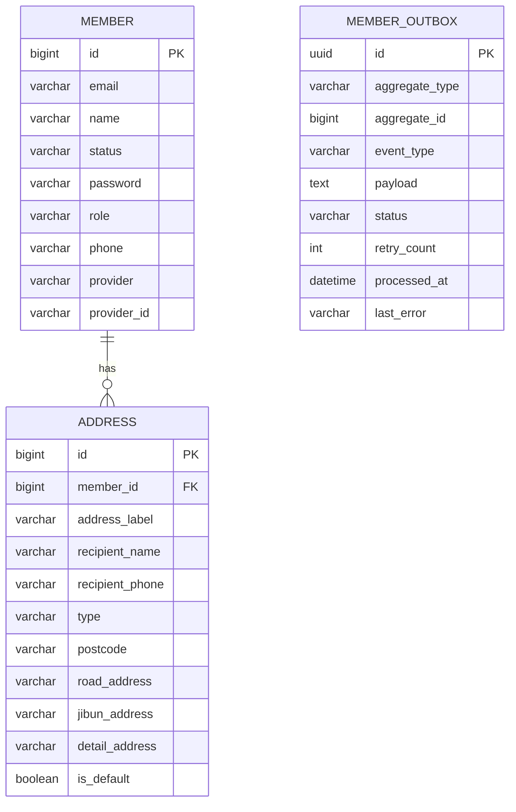
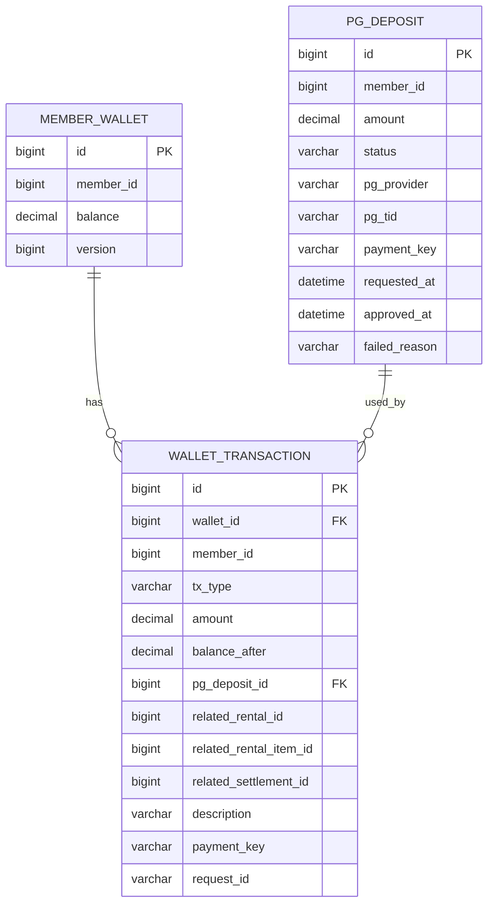
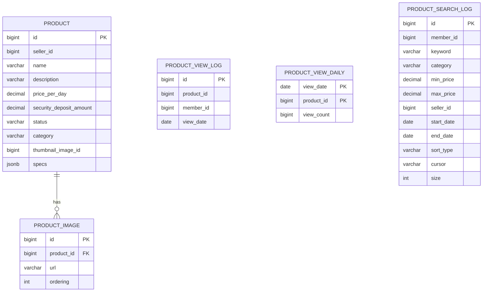
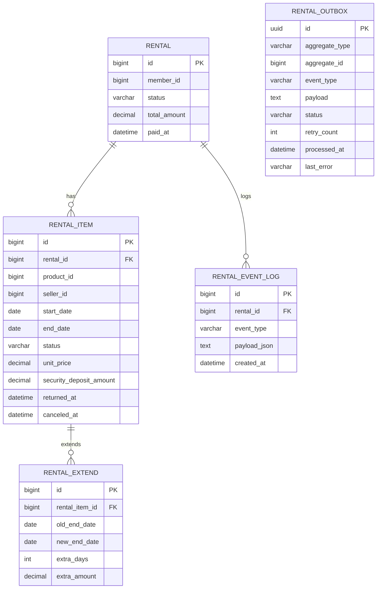
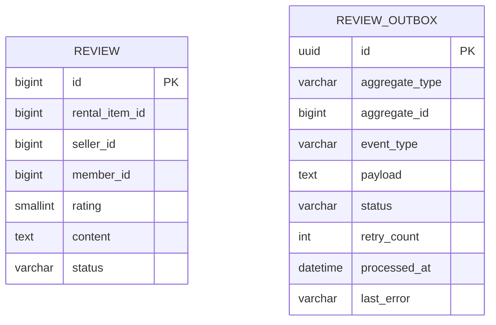
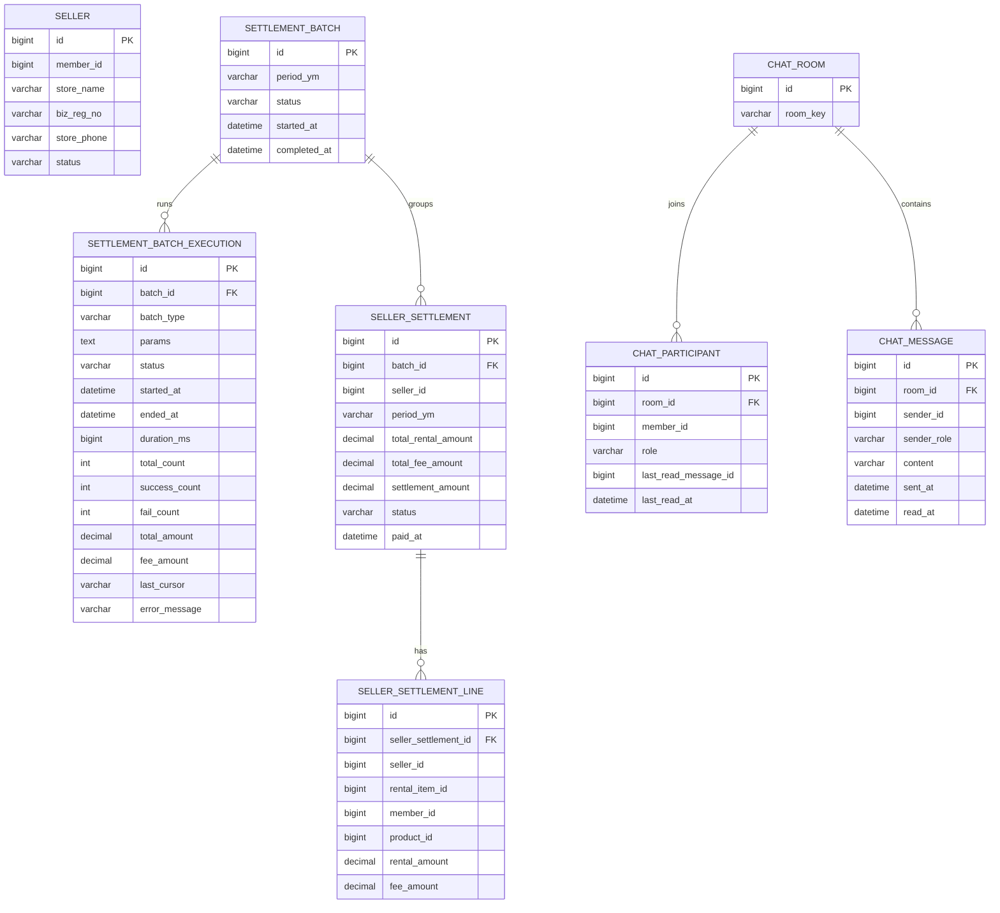
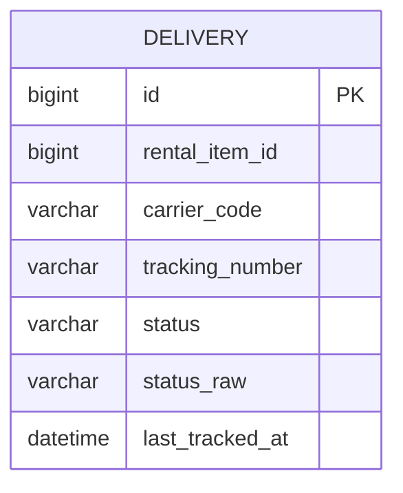
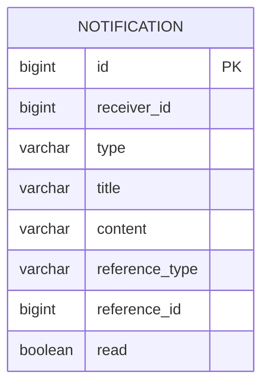

# DB ERD (요약)

## 공통
- 서비스별로 독립 스키마를 사용합니다.
- 대부분의 테이블은 `BaseEntity`를 상속하여 `created_at`, `updated_at` 컬럼을 포함합니다.
- 일부 테이블은 외부 서비스의 ID를 참조하지만 FK 제약은 두지 않습니다. (논리적 참조)

## member 스키마

## account 스키마

## product 스키마

## rental 스키마

## review 스키마

## seller 스키마

## delivery 스키마

## notification 스키마

